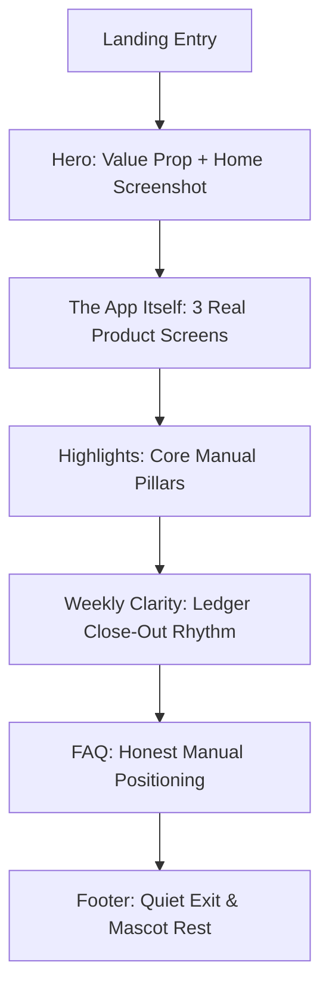

# Senzen Landing Refresh Design Specification

## 1. Overview

Senzen is a calm, person-centric expense management system rooted in manual entry, deliberate habit formation, zero notifications, and total privacy (no automated bank scraping, no rule engines, no AI financial advisors).

The previous landing page suffered from "AI automation" template drift (Composer template remnants, fake automated rule counters, AI prompt demos, and inconsistent neon accents). This refresh establishes an honest, grounded narrative:
- **Tone & Voice**: Calm luxury, quiet confidence, lowercase typography discipline, unhurried financial mindfulness.
- **Visual Substrate**: Paper-grid canvas (`#EEEEEE`), crisp carbon ink (`#0A0A0A`), single emerald brand anchor (`#1EC072`), warm architectural hairlines (`#E5E5E5`).
- **Narrator System**: A cohesive flat-style bear mascot (Kong.gg-style character playbook) who guides the reader through the interface. The mascot lives strictly in the margins/narrative slots and **never** inside the clean product screenshots.
- **Proof-Over-Promises**: Clean, browser-framed screenshots of the real working application (`/screenshots/home.png`, `/screenshots/report.png`, `/screenshots/plans.png`).

---

## 2. UX Flow & Information Architecture

The landing page follows a single-column, unhurried narrative scroll designed to demystify personal budgeting in 4 minutes.



### Section State Matrix

| Section | Loading / Fallback | Default Presentation | Interactive / Hover State | Error / Broken Asset State |
| :--- | :--- | :--- | :--- | :--- |
| **Hero** | Neutral skeleton pulse for screenshot frame | Left: Mascot badge + lowercase tagline + CTA. Right: Browser-framed `/screenshots/home.png` | Primary CTA subtle scale `0.98` on click; hover `translate-x-0.5` on icon | Shimmer frame with subtle SVG fallback wireframe |
| **The App Itself** | 3 skeleton cards with 16:10 aspect ratio | 3-pane responsive grid showing Home, Report, and Plans with lowercase captions | Frame hover elevates shadow by 4px (`shadow-xl`); caption underline expands | Placeholder grid box with label "screenshot unavailable" |
| **Highlights** | Static text (zero CLS) | 4-column numbered grid (`01`–`04`) with `#1EC072` dot-matrix anchors | Number glows subtle emerald on hover | N/A (pure typography/tokens) |
| **Weekly Clarity** | Static simulated ledger bars | Ledger close-out rows with progress indicators and on-track tags | Bar fill smooth transition on viewport enter | Fallback table layout |
| **FAQ** | Closed accordion state | 4 collapsible items with single `#1EC072` accent marker | Expand/collapse with rotating plus icon (`rotate-45`) | All items default expanded if JS fails |
| **Footer** | Static | Clean multi-column links + sleeping bear mascot stamp | Link color `#EEEEEE` → `#1EC072` transition | Static copyright footer |

---

## 3. Colors

Strict 60-30-10 palette discipline. Exactly **one** primary brand color (`#1EC072`) is permitted across the entire page. All purple (`#8B5CF6`), blue (`#0EA5E9`), and amber (`#F59E0B`) accent strips are banned.

| Token | Hex Value | Role & Usage | OKLCH Target |
| :--- | :--- | :--- | :--- |
| `background` | `#EEEEEE` | Paper canvas substrate across 100% of landing sections (no section inversions) | `oklch(0.94 0.002 210)` |
| `foreground` | `#0A0A0A` | Primary ink for headlines, borders, and solid CTA buttons | `oklch(0.12 0.005 190)` |
| `surface` | `#FFFFFF` | Screenshot frames, accordion active cards, and modal sheets | `oklch(1.00 0.000 0)` |
| `primary` | `#1EC072` | The sole brand green: dot halos, on-track indicators, progress fill, active accents | `oklch(0.72 0.19 151)` |
| `primary-hover` | `#049F55` | Darkened green for active and pressed states | `oklch(0.60 0.18 151)` |
| `muted-foreground` | `#555555` | Eyebrow labels, numbers, metadata, inactive indicators | `oklch(0.44 0.005 210)` |
| `body-text` | `#333333` | Longform narrative copy, explanatory paragraphs | `oklch(0.28 0.005 210)` |
| `border` | `#E5E5E5` | Structural dividers, grid hairlines, screenshot window frames | `oklch(0.91 0.003 210)` |

---

## 4. Typography

### Rules & Hierarchy
1. **Lowercase Voice Discipline**: Eyebrows, feature tags, and subheadings embrace a relaxed, modern lowercase aesthetic (e.g., `senzen / your money, remembered.`).
2. **Anti-Slop Ban**: Zero `uppercase tracking-*` kicker/eyebrow typography in generated markup.
3. **Weight Restraint**: Maximum **1** `font-bold` / `font-extrabold` element per section. Body text stays at `font-normal` (400) or `font-light` (300).
4. **Tight Display Tracking**: Large display headers enforce `tracking-[-0.04em]` to `tracking-[-0.05em]`.

| Level | Size (Tailwind / CSS) | Weight | Tracking | Usage |
| :--- | :--- | :--- | :--- | :--- |
| `display-hero` | `text-[4.5rem] md:text-[8rem] lg:text-[10rem]` | 800 | `-0.05em` | Hero brand title "Senzen" |
| `h1` | `text-3xl md:text-5xl lg:text-6xl` | 800 | `-0.04em` | Hero secondary display |
| `h2` | `text-3xl md:text-4xl lg:text-5xl` | 700 | `-0.03em` | Section display headlines |
| `h3` | `text-lg md:text-xl` | 600 | `-0.02em` | Feature card titles, FAQ triggers |
| `eyebrow` | `text-xs md:text-sm` | 500 (mono) | `-0.01em` | Section anchors with mascot inline |
| `body-lg` | `text-lg md:text-xl` | 400 | `-0.01em` | Hero tagline and lead sentences |
| `body-md` | `text-sm md:text-base` | 400 | `0em` | Explanatory copy, FAQ answers |
| `caption` | `text-xs` | 400 (mono) | `0em` | Screenshot captions, ledger stamps |

---

## 5. Layout

- **Substrate Grid**: Global 4rem × 4rem hairline grid (`#E5E5E5` lines at 50% opacity) on `#EEEEEE` background.
- **Section Rhythm**: Alternating visual weights across sections:
  1. Hero: Asymmetrical split (Left: text + CTA; Right: hero browser window)
  2. The App Itself: 3-column / 2+1 responsive screenshot bento
  3. Highlights Band: 4-cell horizontal rule grid (`01`–`04`)
  4. Weekly Clarity: 2-column split (Left: narrative copy; Right: live ledger bars)
  5. FAQ: Centered narrow column (max-w-3xl) with clean dividers
  6. Footer: 4-column minimal dark anchor (`#0A0A0A`)
- **Grid Container**: `max-w-7xl mx-auto px-6 md:px-10`.

---

## 6. Elevation & Depth

- **Elevation 0 (Canvas)**: Background paper `#EEEEEE`.
- **Elevation 1 (Screenshots & Cards)**: White surface `#FFFFFF` with `border: 1px solid #E5E5E5` and soft directional ambient shadow: `box-shadow: 0 20px 40px -15px rgba(0, 0, 0, 0.07), 0 0 0 1px rgba(0,0,0,0.03)`.
- **Elevation 2 (Interactive Floating)**: Hovered screenshot or popover with `box-shadow: 0 25px 50px -12px rgba(0, 0, 0, 0.12)`.
- **No Heavy Skew/3D Collages**: All screenshots sit parallel to the viewport with 0-degree tilt for maximum readability.

---

## 7. Shapes

- **Base Radius**: `--radius: 0.375rem` (6px).
- **Screenshot Window Frames**: `rounded-xl` (12px) with concentric inner screenshot image `rounded-lg` (8px). Formula: `R_inner = R_outer - padding = 12px - 4px = 8px`.
- **Pill Buttons & Tags**: `rounded-full` (9999px) for CTAs and status badges.
- **Mascot Anchors**: Organic, unconstrained transparent silhouettes floating adjacent to cards.

---

## 8. Components

### Component State Specifications

#### Primary Action Button (`<Button>`)
- **Default**: `bg-[#0A0A0A] text-[#FFFFFF] rounded-full px-8 py-3.5 font-semibold text-base md:text-lg flex items-center gap-2`
- **Hover**: `bg-[#262626]`, arrow icon translates right by `2px` (`group-hover:translate-x-0.5 transition-transform`)
- **Pressed / Active**: `scale-[0.98]`
- **Focus**: `focus-visible:ring-2 focus-visible:ring-[#0A0A0A] focus-visible:ring-offset-2 focus-visible:ring-offset-[#EEEEEE]`

#### Browser Screenshot Frame (`<BrowserFrame>`)
- **Structure**:
  ```tsx
  <div className="relative rounded-xl border border-[#E5E5E5] bg-white p-2 md:p-3 shadow-[0_20px_40px_-15px_rgba(0,0,0,0.07)]">
    {/* Minimal Window Header */}
    <div className="flex items-center gap-1.5 pb-2 md:pb-2.5 px-1 border-b border-[#F0F0F0] mb-2">
      <div className="h-2 w-2 rounded-full bg-[#E5E5E5]" />
      <div className="h-2 w-2 rounded-full bg-[#E5E5E5]" />
      <div className="h-2 w-2 rounded-full bg-[#E5E5E5]" />
      <span className="ml-2 font-mono text-[10px] text-[#888888]">{label}</span>
    </div>
    {/* Clean Image Slot */}
    <div className="relative overflow-hidden rounded-lg bg-[#F7F7F7] aspect-[16/10]">
      
    </div>
  </div>
  ```

---

## 9. Do's and Don'ts

| Do | Don't |
| :--- | :--- |
| **Do** use lowercase typography for eyebrows and section subheaders (`senzen / manual money`). | **Don't** use `uppercase tracking-widest` template tells. |
| **Do** keep real product screenshots strictly parallel and framed in minimal browser chrome. | **Don't** use 3D skewed angles, isometric tilts, or chaotic overlapping collages. |
| **Do** place the mascot as an external narrator in margins, section corners, and eyebrows. | **Don't** put the mascot inside product screenshots or fake UI screens. |
| **Do** stick to the single green accent (`#1EC072`) with `#0A0A0A` ink on `#EEEEEE` paper. | **Don't** reintroduce purple, cyan, or amber dotted background tags. |
| **Do** describe real features: manual transaction logging, category budgets, monthly reports. | **Don't** invent automated money movement, AI planners, or bank sync claims. |

---

## 10. Page Layout & Component Grid

### A. Hero Section Spec (`HeroComposer`)
- **Layout**: 2-column grid (`grid-cols-1 lg:grid-cols-[1.1fr_0.9fr] gap-12 lg:gap-16 items-center`).
- **Left Column (Typography & Action)**:
  1. Eyebrow Badge: Inline flex container holding `bear-mini-peeking.png` (~32px × 32px) + text `senzen / manual money` in `font-mono text-sm text-[#555555]`.
  2. Hairline Accent: `h-[2px] w-20 bg-[#0A0A0A] mt-4 mb-6`.
  3. Brand Headline: Giant "Senzen" (`text-[4.5rem] md:text-[8rem] lg:text-[9.5rem] font-extrabold tracking-tighter leading-[0.85]`) with emerald dot-matrix shadow block (`bg-[#1EC072]` with radial dot pattern).
  4. Tagline: "your money, remembered." (`font-sans text-xl md:text-2xl text-[#0A0A0A] font-medium mt-6`).
  5. Value Sentence: "Manual capture. No bank sync. No notifications. Just calm clarity on where your money went." (`font-sans text-base md:text-lg text-[#333333] mt-3 max-w-lg leading-relaxed`).
  6. Action CTA: `<Link href="/sign-up">` pill button + secondary text link "see live demo →".
- **Right Column (Hero Screenshot Framing)**:
  - Replaces floating giant mascot with a real desktop browser window showing `/screenshots/home.png`.
  - Decorated with a subtle emerald dotted halo backdrop (`opacity-[0.12]`, size 16px).
  - Browser header label: `senzen.app/home — active plans`.

### B. "The App Itself" Section Spec (`AppScreenshotsSection`)
- **Header**:
  - Eyebrow with narrator mascot `bear-magnifier-inspect.png` sitting right above header.
  - Title: `the app itself.` in `font-sans text-3xl md:text-5xl font-bold tracking-tight text-[#0A0A0A]`.
  - Subtitle: `Three views. No clutter. Every dollar accounted for by you.`
- **Screenshot Grid**:
  - Desktop: 3-column layout (`grid grid-cols-1 md:grid-cols-3 gap-8`).
  - **Card 1 (Home View)**:
    - Frame: `/screenshots/home.png`
    - Window Tag: `01 · home`
    - Caption: `active plans at a glance — progress bars that stay honest without auto-debits.`
  - **Card 2 (Reports & Breakdown)**:
    - Frame: `/screenshots/report.png`
    - Window Tag: `02 · reports`
    - Caption: `month · year · all toggles — see your category spending breakdown without noisy analytics.`
  - **Card 3 (Plan & Envelopes)**:
    - Frame: `/screenshots/plans.png`
    - Window Tag: `03 · plans`
    - Caption: `category envelopes — groceries, transport, dining out. Set your ceiling and log as you go.`

---

## 11. Responsive & Platform Matrix

| Section | Mobile (<768px) | Tablet (768px–1024px) | Desktop (>1024px) | Platform Constraints & Verification |
| :--- | :--- | :--- | :--- | :--- |
| **Hero** | Stacked 1-column. Small bear (28px) inline with eyebrow. Screenshot scales to 100% width with 16:10 aspect ratio. | 1-column with max-w-2xl centered or left-aligned. Screenshot height ~380px. | 2-column split `1.1fr : 0.9fr`. Screenshot height ~480px. | Min touch target 48px for CTA. Zero horizontal overflow (`overflow-x-hidden`). |
| **The App Itself** | 1-column vertical stack with 32px gap between frames. Captions directly below each frame. | 2-column bento (Card 1 full width, Cards 2 & 3 side by side). | 3-column equal grid (`gap-8`). Subtle 8px vertical stagger on center card for visual air. | Images use `loading="lazy"` with explicit aspect ratio to prevent CLS. |
| **Highlights** | 1-column vertical list with divider borders between items. | 2-column grid (`2x2`). | 4-column horizontal band (`01` through `04`). | Font sizes drop from `text-xl` to `text-lg` on mobile. |
| **Weekly Clarity** | Stacked 1-column. Narrative first, ledger rows second. | 2-column grid (`1fr : 1fr`). | 2-column grid with right border divider. | Ledger bar animations disabled if `prefers-reduced-motion: reduce`. |
| **FAQ** | Full width accordion with 16px touch padding per item. | Centered max-w-2xl. | Centered max-w-3xl. | Touch target ≥ 48px on triggers; keyboard accessible (Tab + Enter/Space). |
| **Footer** | 2-column link grid with copyright at bottom. | 4-column grid. | 4-column grid with sleeping bear badge. | WCAG AA contrast on dark background (text `#BBBBBB` on `#0A0A0A` = 9.1:1). |

---

## 12. Navigation Decision

- **Pattern**: Minimal Sticky Topbar with Hairline Bottom Border.
- **Left**: `senzen` wordmark in lowercase sans bold (`text-xl font-bold tracking-tight text-[#0A0A0A]`) with a 4px green dot.
- **Center**: Hidden on mobile; desktop shows 3 anchors: `the app`, `how it works`, `faq`.
- **Right**: Simple `sign in` text link + `get started` mini-pill button.

---

## 13. Motion & Interaction

- **Duration Floor**: 200ms–300ms for hover and accordion transitions.
- **Easing**: Standard ease-out `cubic-bezier(0.16, 1, 0.3, 1)`.
- **Banned Animations**: Particle effects, floating bounce loops, parallax scroll hacking, spinning masot badges.
- **Micro-Interactions**:
  - Button Hover: Arrow icon translation `translateX(3px)`.
  - Accordion Trigger: Plus icon rotation `transform: rotate(45deg)` (200ms).
  - Screenshot Frame Hover: Subtle shadow expansion (`shadow-md` → `shadow-xl`) and `translateY(-2px)`.

---

## 14. Visual Asset Plan: Bear Pose System (Kong Playbook)

To maintain character consistency, all bear assets share the exact same geometric silhouette, palette, and flat sticker illustration aesthetic.

### 5 Canonical Mascot Poses

| Pose ID | File Name | Placement / Section | Mood / Scene Description |
| :--- | :--- | :--- | :--- |
| **P1** | `bear-mini-peeking.png` | Hero Eyebrow (inline left of text) | Tiny 32px peeking bear head/paws resting peacefully on the baseline. Calm, friendly greeting. |
| **P2** | `bear-magnifier-inspect.png` | "The App Itself" Section Anchor | Bear holding a small wooden magnifying glass, looking down attentively at a paper receipt. |
| **P3** | `bear-pencil-tally.png` | Highlights Band Header / Side | Bear sitting cross-legged with a small pencil and tally notebook, writing calmly. |
| **P4** | `bear-tea-relax.png` | Weekly Clarity Section | Bear sitting comfortably with a warm cup of green tea, enjoying stress-free financial peace. |
| **P5** | `bear-sleep-peaceful.png` | Footer Exit Stamp | Bear curled up sleeping cozily on top of the copyright block ("your money, resting easy"). |

### Reusable `img` CLI Style-Lock Prompt Template

Use this exact prompt format with the `img` CLI tool to generate additional or replacement poses with guaranteed visual consistency:

```bash
img "flat minimalist vector sticker of a cute chubby brown bear mascot, [INSERT POSE/ACTION HERE], smooth solid warm-brown fur (#8D5B4C), round ears with light tan inner ear (#D9B99B), soft cream oval muzzle (#F4E7D3), simple black circle bead eyes, small triangular black nose, thick smooth charcoal outline (#2B1E1A), clean vector art, 2D flat design, matte solid colors, no 3D rendering, no gradients, no photorealism, isolated on transparent background, white sticker border padding" -o public/mascot/[FILENAME].png -s 1024x1024 -q high
```

*Example Invocation for P2:*
```bash
img "flat minimalist vector sticker of a cute chubby brown bear mascot, holding a small round magnifying glass inspecting a paper receipt, smooth solid warm-brown fur (#8D5B4C), round ears with light tan inner ear (#D9B99B), soft cream oval muzzle (#F4E7D3), simple black circle bead eyes, small triangular black nose, thick smooth charcoal outline (#2B1E1A), clean vector art, 2D flat design, matte solid colors, no 3D rendering, no gradients, no photorealism, isolated on transparent background, white sticker border padding" -o frontend/public/mascot/bear-inspect.png
```

---

## 15. Component Audit & Kill-List

| Component File | Verdict | Reason & Specific Action |
| :--- | :--- | :--- |
| `frontend/src/components/example/ai-plan-demo.tsx` | **KILL (DELETE ENTIRELY)** | **Reason**: Sells pure backend fiction ("Ask for a plan in plain language", "Auto-save nudge", conversational AI prompts). The real app is a straightforward CRUD planner.<br>**Action**: Remove component and replace its page slot with `AppScreenshotsSection`. |
| `frontend/src/components/example/spotlight-demo.tsx` | **REWRITE (`HeroComposer`) & KILL (`HeroStatsBand`)** | **Reason**: `HeroStatsBand` contains fake arbitrary metrics. `HeroComposer` has template tell "Meet", giant floating mascot on the right with no product proof, and outdated copy.<br>**Action**: Delete `HeroStatsBand`. Rewrite `HeroComposer` to include the inline 32px bear eyebrow, new tagline "your money, remembered.", and browser-framed `/screenshots/home.png` on the right. |
| `frontend/src/components/example/highlights-band.tsx` | **KEEP WITH REWRITE** | **Reason**: Contains banned purple `#8B5CF6` dotted highlight and `uppercase tracking-wider` eyebrow (`MORE FROM SENZEN`).<br>**Action**: Replace purple highlight with `#1EC072` dot matrix; change eyebrow to lowercase `more from senzen`; rewrite the 4 cards to highlight honest manual features (01: custom duration plans, 02: category envelopes, 03: intentional manual entry, 04: clear progress without noise). |
| `frontend/src/components/example/weekly-clarity.tsx` | **KEEP WITH REWRITE** | **Reason**: Contains banned cyan `#0EA5E9` highlight and `STREAK · 3 WEEKS ON TRACK` uppercase kicker.<br>**Action**: Standardize highlight color to brand green `#1EC072`; remove uppercase tracking; connect narrative directly to the real report page's week-by-week ledger close-out. |
| `frontend/src/components/example/faq-section.tsx` | **KEEP WITH AUDIT** | **Reason**: Q3 mentions auto-save without making clear it is only a visual reminder.<br>**Action**: Update FAQ copy to explicitly affirm zero bank sync, manual privacy, and honest reminder toggles. Ensure accordion trigger uses lowercase font and `#1EC072` dot highlight. |
| `frontend/src/components/example/footer.tsx` | **KEEP WITH POLISH** | **Reason**: Uppercase `SENZEN` title and generic subtext.<br>**Action**: Add `bear-sleep-peaceful.png` stamp above copyright note; update subtext to "your money, remembered.". |

---

## 16. Missing UI State Analysis (Domain Invariant)

**Question**: What UI state is missing (empty, loading, error, permission denied)?

**Finding**: **Image Loading & Network Error State for Screenshot Frames**
- **Impact**: User sees broken image icons or collapsed layout rectangles (`0px` height shift) when loading `/screenshots/home.png`, `/screenshots/report.png`, or `/screenshots/plans.png` over a slow network connection or if an asset fails to resolve. Because the new landing page's entire credibility hinges on proof-of-product screenshots, an unhandled image failure renders the core value proposition invisible.
- **Specification Remedy Needed**: The `<BrowserFrame>` component must enforce a fixed aspect ratio wrapper (`aspect-[16/10]`) with a subtle `#F7F7F7` skeleton placeholder and an SVG wireframe fallback if an image fails to load.

---

## 17. Post-Build Critique Checklist

When evaluating the implemented landing page against this specification:
1. [ ] **Color Check**: Grep for `#8B5CF6`, `#0EA5E9`, `#F59E0B`, or purple/cyan/blue classes. Zero allowed outside of the single `#1EC072` green.
2. [ ] **Eyebrow Check**: Grep for `uppercase tracking-*`. Zero allowed. All eyebrows must be lowercase mono or sans.
3. [ ] **Mascot Check**: Verify bear mascot is nowhere inside the product UI screenshots. Verify bear appears in designated narrative positions (Hero eyebrow, Screenshots header, Footer).
4. [ ] **Screenshot Frame Check**: Verify all 3 screenshots (`/screenshots/home.png`, `/screenshots/report.png`, `/screenshots/plans.png`) are framed in clean browser chrome without 3D tilt.
5. [ ] **Factual Honesty Check**: Verify no references to AI prompts, automated bank moving, or backtesting remain in the rendered DOM.
